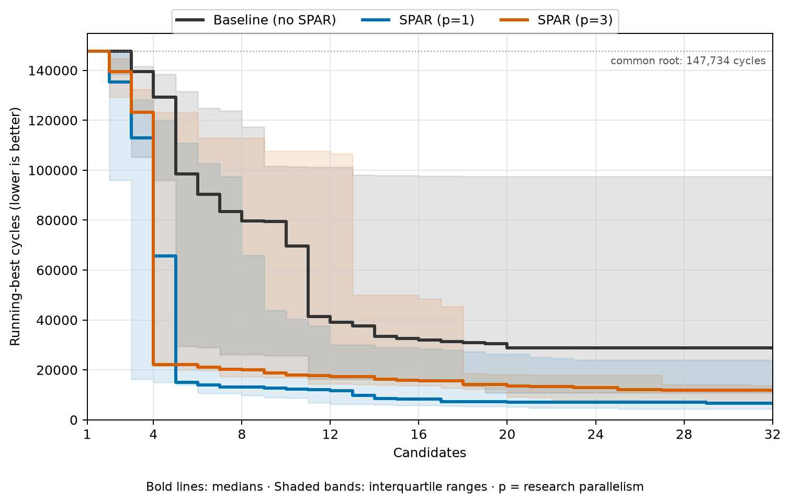
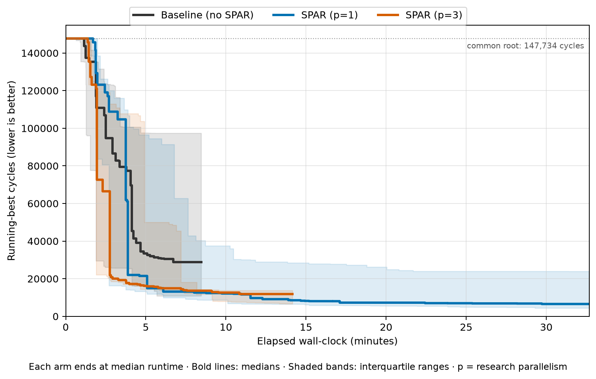

# SPAR

**Structured Parallel Automated Research**

SPAR is a command-line tool for structured, parallel automated research, combining Monte Carlo tree search guidance with judgement from delegated research agents.

- **Structured**: explicit objective, candidate hypotheses, lineage, measurements, decisions, and artifacts
- **Parallel**: isolated candidate work proceeds concurrently

## Comparison

Comparison of a simple sequential agent (no subagents) with SPAR at different parallelism levels, using the same harness and model across N=8 runs on a [VLIW SIMD optimization problem](https://github.com/anthropics/original_performance_takehome). Each run used 32 candidate iterations.

<p align="center">
  
  
</p>

Early results suggest that SPAR reaches better results with fewer candidate iterations and lower variance.

With a fresh agent session for every turn, both SPAR configurations took longer to complete all 32 candidates than the simple sequential agent, with p=1 taking the longest. This motivated SPAR's subsequent transition to persistent agent sessions; see [LEARNINGS.md](LEARNINGS.md).

Caveat: proof-of-concept results from limited resources, not a rigorous benchmark.

## MCTS Visualizations

Explore SPAR's search progression through these [interactive visualizations](https://vliw-simd.mrhooray.com/spar/).

## NanoGPT speedrun

SPAR research improved on the July 17, 2026 upstream best by **5.2 seconds (6.9%)**: 75.772s → 70.554s across eight seeds on the same GCP 8×H100 allocation. See [nanogpt/](nanogpt/) for the solution, validation results, and raw logs.

## Installation

Requires [uv](https://docs.astral.sh/uv/):

```sh
uv tool install --python 3.14 git+https://github.com/mrhooray/spar.git
```

Supported harnesses: `codex`, `claude-code`, `opencode`, and `pi`.

## Getting Started

Inside the target Git repository:

```sh
spar init SESSION_NAME
```

```text
Initialized session SESSION_NAME.

Edit:
  objective: /path/to/repo/.spar/SESSION_NAME/objective.md
  config:    /path/to/repo/.spar/SESSION_NAME/config.toml
```

```sh
spar start SESSION_NAME
```

Check progress or inspect candidates with:

```sh
spar status SESSION_NAME
spar top SESSION_NAME
spar inspect SESSION_NAME CANDIDATE_ID
```

Use `spar stop SESSION_NAME` or press `Ctrl-C` to request a stop. A repeated `spar start SESSION_NAME` continues a stopped or interrupted session.
